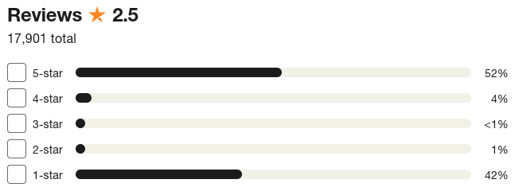

Currently I am in a character development arc, in particular dealing with moving because the building management in my building is awful and has just left a leak to make my flat unfit for habitation, and because of that I have learned that one has to be very wary about the company or person which manages the building where you live.
And in this search it seems like people who provide reviews for these kind of things have a very strong opinion either positive or negative.
Which makes sense, since normally you only have to deal with the building management of a place when things go wrong, so you will either love them or hate them.

However, although helpful to know when somebody is unreliable or a darling, we also need to know when they are just *mhe*.

I see sometimes that in a five star rating for anything, we see a distribution of opinions which looks like the *sign of the horns*, e.g.

And my problem is that this picture is no representative because if I was to just saw the average rating of the service I would assume that the service is just mediocre, and then when I see the breakdown of it is just as useless since the amount of people who love it is very similar to the amount of people who hat it.

We need to be able to assess mediocrity, and I have been guilty as well of not providing useful feedback to the mediocre places, but will start that now hoping to make a small difference for those others who also look for a review saying honest things about services, products or places which are just *mhe*.
