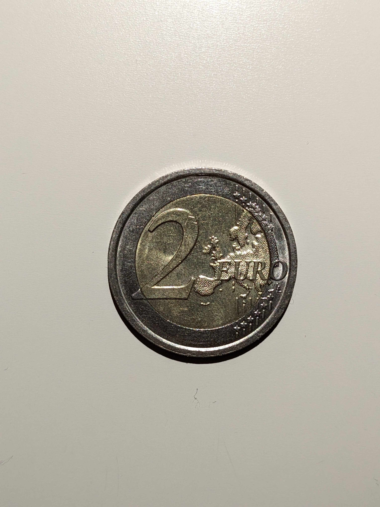
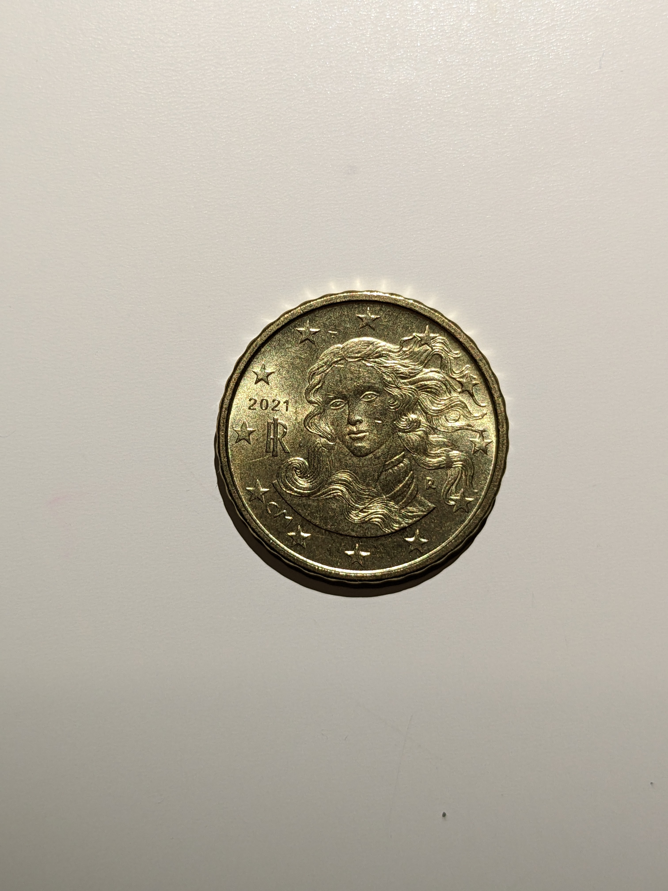

This is my coin and bank notes collection.
Nothing fancy, mostly circulating tender.

# México (Mexican peso)

## Circulating coins

| Denomination  | Year | Picture | Design |
| :---          | :--- | :---    | :---   |
| 10 pesos      | 2021 |         |        |
| 10 pesos      | 2000 |         |        |
| 5 pesos       | 2021 |         |        |
| 5 pesos       | 2008 |         |        |
| 2 pesos       | 2021 |         |        |
| 2 pesos       | Unkn |         |        |
| 1 peso        | 2021 |         |        |
| 50 cents      | 2021 |         |        |

## Circulating notes

| Denomination  | Year | Picture | Design |
| :---          | :--- | :---    | :---   |
| 1000 pesos    | 2021 |         |        |
| 500 pesos     | 2021 |         |        |
| 200 pesos     | 2021 |         |        |
| 100 pesos     | 2021 |         |        |
| 50 pesos      | 2021 |         |        |
| 50 pesos      | 2021 |         |        |
| 20 pesos      | 2021 |         |        |
| 20 pesos      | 2021 |         |        |

## Out of circulation coins

| Denomination   | Year | Picture | Design |
| :---           | :--- | :---    | :---   |
| 20 pesos       | 1982 |         |        |
| 5 centavos     | 1936 |         |        |

## Special coins

| Coin                 | Year | Picture | Design |
| :---                 | :--- | :---    | :---   |
| 1 Oz. Plata Libertad | 2021 |         |        |

# United Kingdom (Pound sterling)

## Circulating coins

| Denomination | Year | Picture | Design |
| :---         | :--- | :---    | :---   |
| 2 pounds     | 2012 |         |        |
| 2 pounds     | 2005 |         |        |
| 1 pound      | 2020 |         |        |
| 50 pence     | 2019 |         |        |
| 20 pence     | 2011 |         |        |
| 20 pence     | 1982 |         |        |
| 10 pence     | 2015 |         |        |
| 5 pence      | 2012 |         |        |
| 5 pence      | 1991 |         |        |
| 1 penny      | 2012 |         |        |
| 1 penny      | 2007 |         |        |

## Circulating notes

| Denomination | Year | Picture | Design |
| :---         | :--- | :---    | :---   |
| 10 pounds    | 2006 |         |        |
| 5 pounds     | 2005 |         |        |

## Special coins

| Denomination | Year | Picture | Design |
| :---         | :--- | :---    | :---   |
| 1 farthing   | 2021 |         |        |

# Italy (Euro) {#Italy}

## Circulating coins {#ITCirculating}

| Denomination  | Year | Obverse                | Reverse                |
| :---          | :--- | :---                   | :---                   |
| 2 euros       | 2018 |  |  |
| 1 euro        | 2008 |  |  |
| 50 cents      | 2020 |  |  |
| 20 cents      | 2021 |  |  |
| 10 cents      | 2021 |  |  |
| 5 cents       | 2021 |  |  |
| 2 cents       | 2013 |  |  |
| 1 cent        | 2015 |  |  |

# India (Indian rupee)

## Circulating coins

| Denomination  | Year | Picture | Design |
| :---          | :--- | :---    | :---   |
| 20 rupees     | 2021 |         |        |
| 10 rupees     | 2015 |         |        |
| 5 rupees      | 2014 |         |        |
| 2 rupees      | 2016 |         |        |
| 1 rupee       | 2014 |         |        |
| 1 rupee       | 2003 |         |        |

## Circulating notes

| Denomination  | Year | Picture | Design |
| :---          | :--- | :---    | :---   |
| 100 rupees    | 2022 |         |        |
| 10 rupees     | 2017 |         |        |

# Thailand (Thai baht)

## Circulating coins

| Denomination  | Year | Picture | Design |
| :---          | :--- | :---    | :---   |
| 10 baht       | Unkn |         |        |
| 1 baht        | Unkn |         |        |
| 1 baht        | Unkn |         |        |
| 25 satang     | Unkn |         |        |

# United States of America

## Circulating notes

| Denomination  | Year | Picture | Design |
| :---          | :--- | :---    | :---   |
| 1 dollar      | 2013 |         |        |
