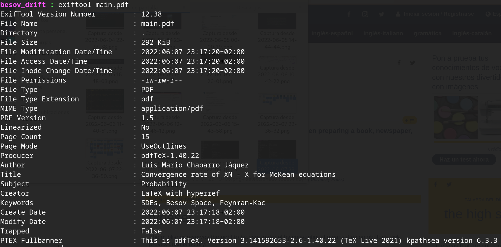

Today I wanted to homogenize the naming on my **totally legally downloaded** (😉) collection of maths books, just to (unsurprisingly) see just how messed up the metadata of files you get online is.

And well, I will fix that for my files but it takes some time, and I will gift you the method I came up with to do so, once I finish. But for now, and since I was of course also guilty of not adding metadata to my documents before today, this is just a reminder of how to add metadata to documents typesetted with LaTeX.

Make sure you are using the package `hyperref` (which you should because your documents also have bookmarks and links between sections and things. Don't they? 😑) and in your preamble just add this:

```
\hypersetup{pdftitle={Title of your file}, 
		pdfsubject={The subject of your file}, 
	        pdfauthor={The authors of your file},
		pdfkeywords={The keywords of your file}
	       }
```

And that is it!

Just as reference, if I add the following to my file

```
\hypersetup{pdftitle={Convergence rate of $X^N - X$ for McKean equations}, 
		pdfsubject={Probability}, 
	        pdfauthor={Luis Mario Chaparro Jáquez},
		pdfkeywords={SDEs, Besov Space, Feynman-Kac}
	       }
```

and then I trow an `exiftool` at `main.pdf` will have the following metadata:



There are many other ways to add useful and non intrusive metadata to files, but I guess if you use LaTeX this is the easiest way.
